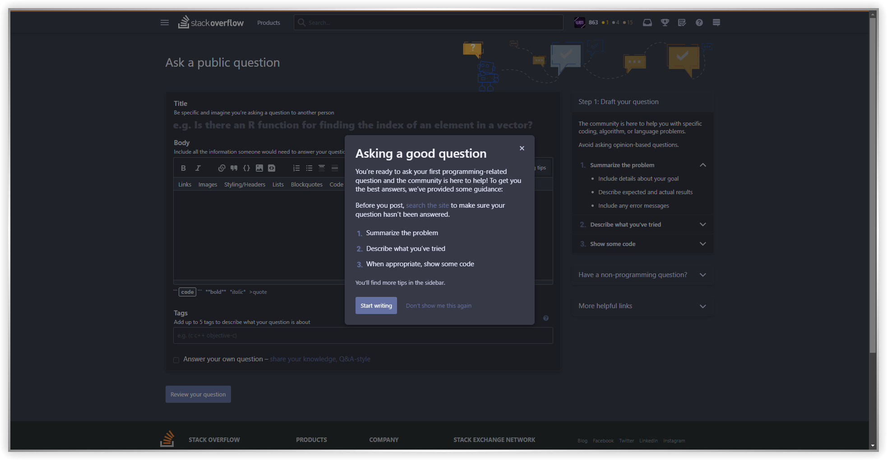

# Dracula for Stack Overflow

This will outline all the settings and what they do

## Accent Color

This is the general shade of color used for everything

Available values are:

- 

    
 Red

    
  

- 

    
 Green

    
  

- 

    
 Cyan

    
  

- 

    
 Orange

    
  

- 

    
 Pink

    
  

- 

    
 Purple

    
  

- 

    
 Yellow

    
  

- 

    
 White

    
  

- 

    
 Comment Color

    
  

## Button Text Color

This color is for all the texts used in the buttons

Available values are:

- 

    
 Black

    
  

- 

    
 White

    
  

- 

    
 Gray

    
  

## Rounded Corners

This is to get rounded corners for sidebar and profile popups

- 

    
✅ Turned On

    <h4>User Popups</h4>
    
    <h4>Sidebar</h4>
    
  

- 

    
❌ Turned Off

    <h4>User Popups</h4>
    
    <h4>Sidebar</h4>
    
  

## Custom HighlightJS

Enable this if you want to use the highlightjs theme as seen in [dracula/highlightjs](https://github.com/dracula/highlightjs)

- 

    
✅ Turned On

    
  

- 

    
❌ Turned Off

    
  

## Code Font

The font used in code blocks, the format is same as [the one used for CSS](https://www.w3schools.com/csSref/pr_font_font-family.asp "A guide")

## Sans Font

The font used for places where stack overflow uses a sans-serif font, the format is same as [the one used for CSS](https://www.w3schools.com/csSref/pr_font_font-family.asp "A guide")

## Serif Font

The font used for places where stack overflow uses a serif font, the format is same as [the one used for CSS](https://www.w3schools.com/csSref/pr_font_font-family.asp "A guide")
