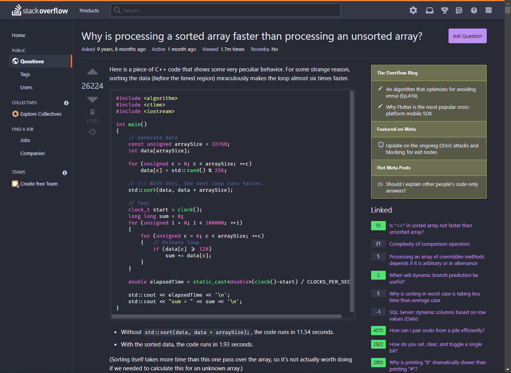

# Dracula for [Stack Overflow](https://stackoverflow.com)

> A dark theme for [Stack Overflow](https://stackoverflow.com).

## Install

All instructions can be found at [draculatheme.com/stackoverflow](https://draculatheme.com/stackoverflow).

## Team

This theme is maintained by the following person(s) and a bunch of [awesome contributors](https://github.com/dracula/stackoverflow/graphs/contributors).

 |
--- |
[Wasi master](https://github.com/wasi-master) |

## License

[MIT License](./LICENSE)